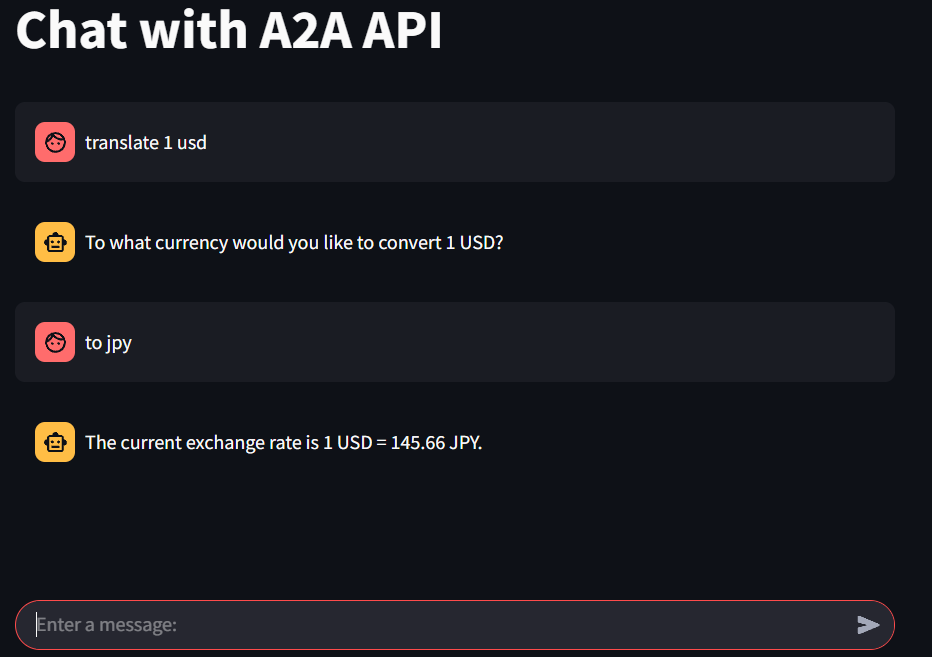
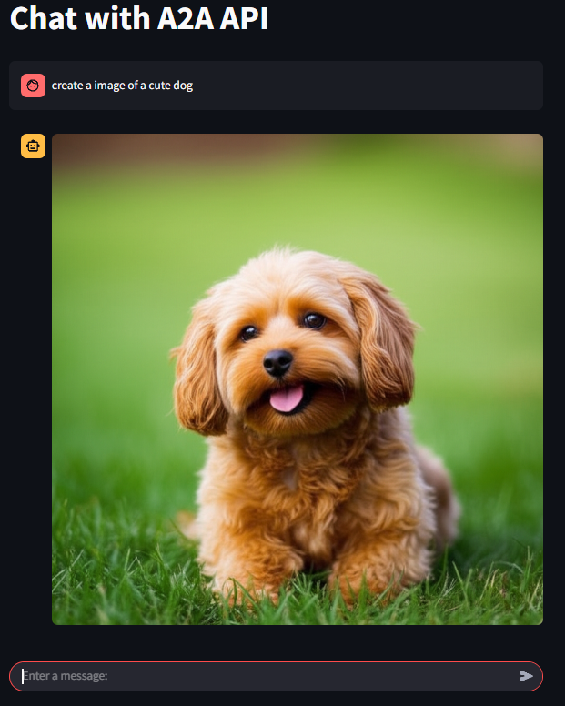
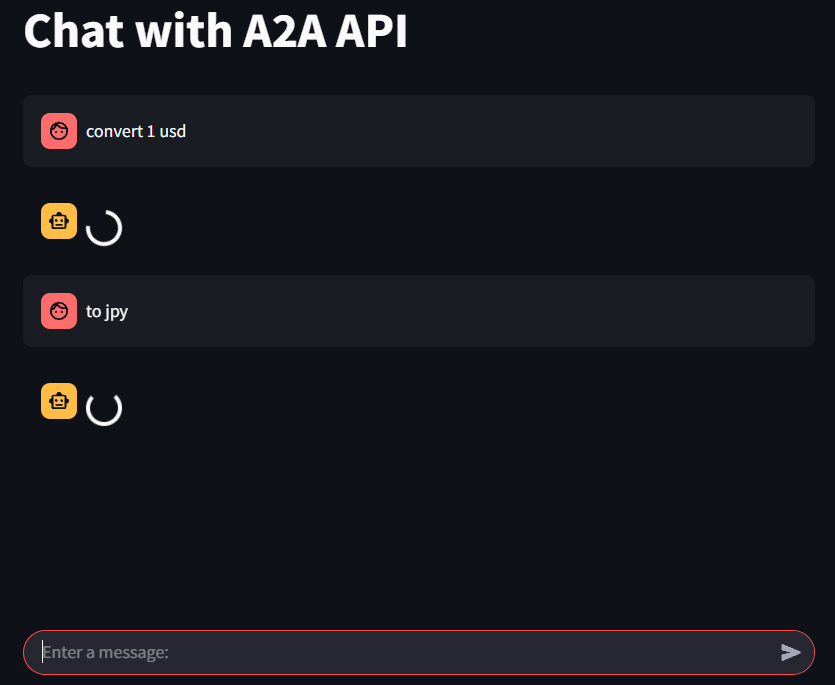

# A2A Streamlit App

This repository is a Streamlit-based reconstruction of the demo published in Google's [A2A project](https://github.com/google/A2A), making it easier to experience.  
A2A provides a framework where multiple AI agents collaborate to solve tasks, and this app allows you to easily try out its main features in your web browser.

## Features

- **Multi-agent collaboration**: Use multiple AI agents (currency conversion, image generation, expense reimbursement) from a single UI
- **Intuitive UI**: Simple and easy-to-understand interface powered by Streamlit
- **Local execution**: No complex setup required, runs easily on your local environment
- **CLI testing supported**: Includes a CLI for server API operation checks and debugging
- **Real-time chat**: By implementing the host agent with FastAPI, you can send chat messages even while the agent is processing, improving user experience

---

## Architecture Highlights

In this app, each AI agent (langgraph, crewai, google_adk) runs as an individual server, and a "host agent" implemented with FastAPI orchestrates them.  
The FastAPI-based host agent receives requests from the client (Streamlit UI) and dispatches them to each agent server.  
**Thanks to FastAPI's asynchronous processing, you can send chat messages or additional requests even while waiting for agent responses**, providing a smooth user experience.

---

## Get Started

### Requirements

- Python 3.10 or higher
- [uv](https://github.com/astral-sh/uv) (for package management and execution)

### Setup Steps

1. Set environment variables(Google API Key). Execute `export GOOGLE_API_KEY=<your_api_key>` or set GOOGLE_API_KEY in `.env` file(set `.env` file in the base directory).
2. Start each agent server (langgraph, crewai, google_adk) in separate terminals.
3. In the client directory, start the FastAPI server and the Streamlit frontend.

```bash
# Terminal 1
cd langgraph
uv sync
uv run .

# Terminal 2
cd crewai
uv sync
uv run .

# Terminal 3
cd google_adk
uv sync
uv run .

# Terminal 4 (Client API server)
cd client
uv sync
uv run uvicorn host_agent_thread:app --reload

# Terminal 5 (Streamlit frontend)
cd client
uv run streamlit run fast_api_client_streamlit.py
```

To add an A2A server, modify the `AGENT_URLS` in `host_agent_thread.py`.

### CLI-based Server Testing

You can also use the CLI to check the operation and debug each A2A server.

```bash
# Terminal 1
cd langgraph
uv run .
# Terminal 2
cd client
uv run client.py --agent http://localhost:10000
```

---

## Demo Features

This app lets you experience the following three agent features:

1. **Currency Agent**  
   Performs currency conversion.  
   

2. **Image Generator**  
   Generates images from text.  
   

3. **Process Reimbursement Tool**  
   Handles expense reimbursement requests and processing.  
   

A loading screen is displayed during processing, and you can send chat messages even while waiting.  


---

## References

- [google/A2A (Official Repository)](https://github.com/google/A2A)
