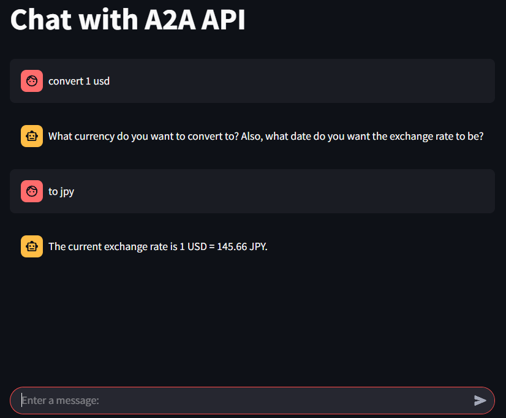

# A2A Streamlit App

このリポジトリは、Googleが公開している[A2Aプロジェクト](https://github.com/google/A2A)のデモを、より手軽に体験できるようStreamlitベースで再構築したものです。  
A2Aは複数のAIエージェントが連携してタスクを解決する仕組みを提供しており、本アプリではその主要な機能をWebブラウザ上で簡単に試すことができます。

## 特徴

- **マルチエージェント連携**: 為替換算、画像生成、経費精算など、複数のAIエージェントを一つのUIから利用可能
- **直感的なUI**: Streamlitによるシンプルかつ分かりやすいインターフェース
- **ローカル実行**: 複雑なセットアップ不要、ローカル環境ですぐに動作
- **CLIテストもサポート**: サーバーAPIの動作確認用CLIも同梱
- **リアルタイムチャット**: ホストエージェントをFastAPIで実装することで、エージェントの処理中でもチャットを送信でき、ユーザー体験が向上しています

---

## アーキテクチャのポイント

本アプリでは、各AIエージェント（langgraph, crewai, google_adk）を個別のサーバーとして起動し、それらを統括する「ホストエージェント」をFastAPIで実装しています。  
このFastAPIベースのホストエージェントがクライアント（Streamlit UI）からのリクエストを受け付け、各エージェントサーバーに処理を振り分けます。  
**FastAPIの非同期処理により、エージェントの応答待ち中でもチャットの送信や追加リクエストが可能**となっており、スムーズなユーザー体験を実現しています。

---

## Get Started

### 必要環境

- Python 3.10 以上
- [uv](https://github.com/astral-sh/uv)（パッケージ管理・実行用）

### セットアップ手順

1. 環境変数を設定します。`export GOOGLE_API_KEY=<your_api_key>` または `.env` ファイルに `GOOGLE_API_KEY` を設定します。(.envファイルはベースディレクトリに配置してください。)
2. 各エージェントサーバー（langgraph, crewai, google_adk）をそれぞれ別ターミナルで起動します。
3. クライアント（client）ディレクトリでFastAPIサーバーとStreamlitフロントエンドを起動します。

```bash
# 1つ目のターミナル
cd langgraph
uv sync
uv run .

# 2つ目のターミナル
cd crewai
uv sync
uv run .

# 3つ目のターミナル
cd google_adk
uv sync
uv run .

# 4つ目のターミナル（クライアントAPIサーバー）
cd client
uv sync
uv run uvicorn host_agent_thread:app --reload

# 5つ目のターミナル（Streamlitフロントエンド）
cd client
uv run streamlit run fast_api_client_streamlit.py
```

※A2Aサーバーを追加する場合は、`host_agent_thread.py`内の`AGENT_URLS`を修正してください。

### CLIによるサーバーテスト

各A2Aサーバーの動作確認やデバッグにはCLIも利用できます。

```bash
# 1つ目のターミナル
cd langgraph
uv run .
# 2つ目のターミナル
cd client
uv run client.py --agent http://localhost:10000
```

---

## デモ機能

本アプリでは、以下の3つのエージェント機能を体験できます。

1. **Currency Agent**  
   為替の換算を行います。  
   

2. **Image Generator**  
   テキストから画像を生成します。  
   

3. **Process Reimbursement Tool**  
   経費精算の申請・処理を行います。  
   

処理中はローディング画面が表示され、待機中もチャットの送信が可能です。  


---

## 参考リンク

- [google/A2A (公式リポジトリ)](https://github.com/google/A2A)
